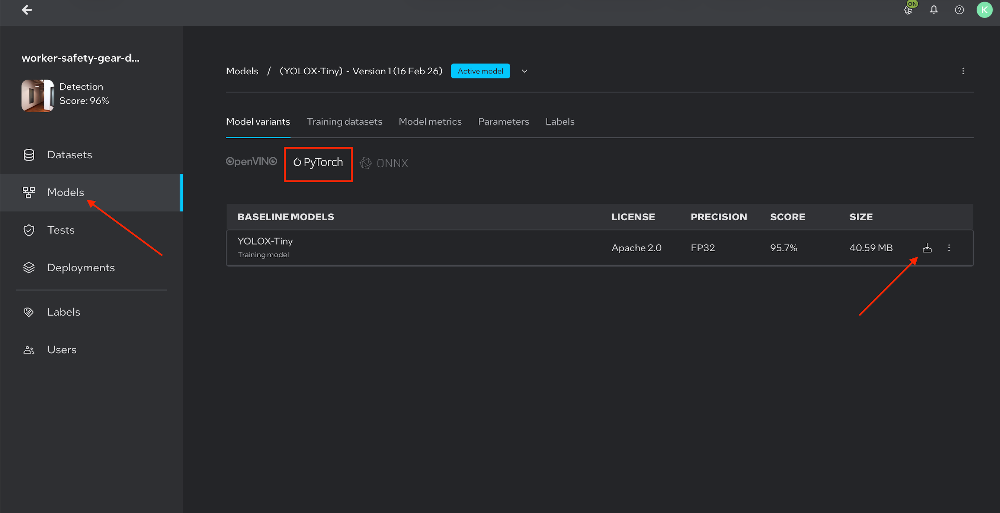
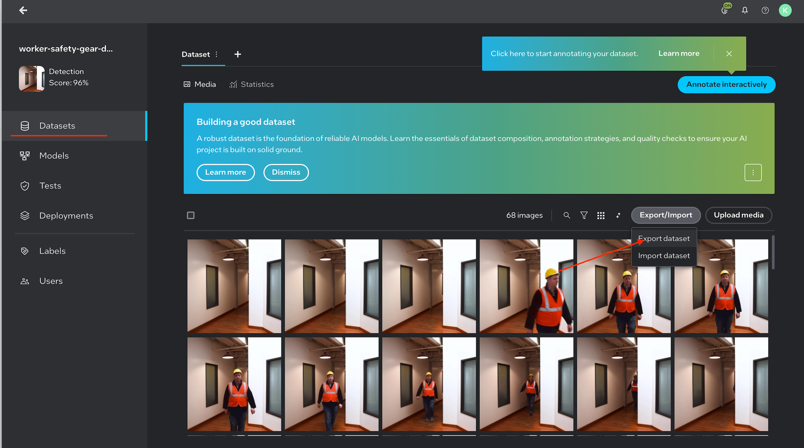
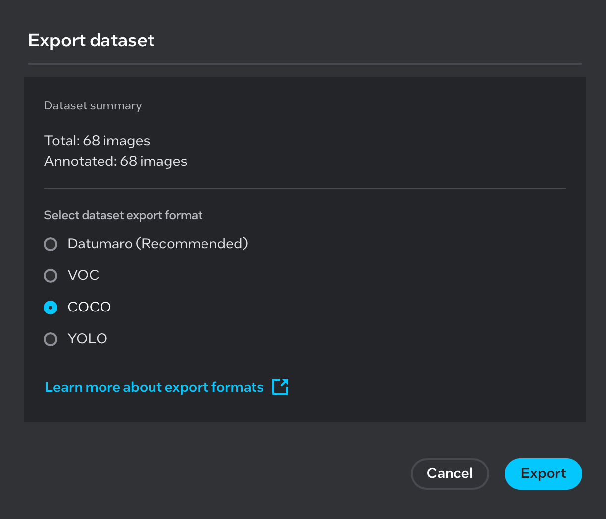
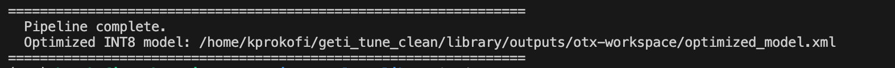

# Export and Optimize Geti Model

## Overview

This guide starts by downloading the trained YOLOX PyTorch weights from Intel Geti and the COCO dataset used during training. A workspace is then set up and the [Training Extensions](https://github.com/open-edge-platform/training_extensions) repository is cloned, which provides the conversion script. After installing the required Python and Rust dependencies, the `export_and_optimize.py` script is run to convert the model to OpenVINO IR format — producing a full-precision FP32 model and an INT8 post-training quantized model optimized for Intel hardware.


## Prerequisites

Before you begin, ensure you have the following:

- A trained model exported from Intel Geti as a **PyTorch weights file** (`.pth`)

  

  *Note: Image is for illustration purposes only.*

- A **COCO-format dataset** (`.zip`) used during training (required for post-training optimization)

  

  

  *Note: Images are for illustration purposes only.*

- [Git](https://git-scm.com/) installed
- Internet access to download dependencies

---

## Step 1: Set Up the Workspace

Create the working directory structure:

```bash
mkdir generate_model
cd generate_model

mkdir model
mkdir coco_dataset
mkdir output
```

| Directory      | Purpose                                      |
|----------------|----------------------------------------------|
| `model/`       | Stores the downloaded PyTorch weights file   |
| `coco_dataset/`| Stores the COCO dataset used for optimization|
| `output/`      | Stores the exported and optimized model files|

---

## Step 2: Add Model Weights and Dataset

### Copy and Extract the PyTorch Model

Place the downloaded `Pytorch_model.zip` file into the `model/` directory and extract it:

```bash
# Copy Pytorch_model.zip into the model directory, then unzip
cp /path/to/Pytorch_model.zip model/
cd model
unzip Pytorch_model.zip
cd ..
```

After extraction, the `model/` directory should contain a `weights.pth` file.

### Copy and Extract the COCO Dataset

Place the downloaded COCO dataset archive into the `coco_dataset/` directory and extract it:

```bash
# Copy the COCO dataset zip into the coco_dataset directory, then unzip
cp /path/to/<coco_dataset>.zip coco_dataset/
cd coco_dataset
unzip <coco_dataset>.zip
cd ..
```

After extraction, the `coco_dataset/` directory should follow the standard COCO layout:

```
coco_dataset/
├── annotations/
└── images/
```

---

## Step 3: Clone the Training Extensions Repository

```bash
git clone https://github.com/open-edge-platform/training_extensions.git
```

---

## Step 4: Install Dependencies

### Install `uv` (Python Package Manager)

```bash
curl -LsSf https://astral.sh/uv/install.sh | sh
source $HOME/.local/bin/env
```

### Install Rust Toolchain (required by some dependencies)

```bash
curl --proto '=https' --tlsv1.2 -sSf https://sh.rustup.rs | sh -s -- -y
```

---

## Step 5: Set Up the Python Environment

Navigate to the `library` directory within the cloned repository and check out the required branch:

```bash
cd training_extensions/library
git checkout kp/test_yolox
```

Create and activate a virtual environment, then sync all dependencies:

```bash
uv venv
source .venv/bin/activate
source "$HOME/.cargo/env"
uv sync
```

---

## Step 6: Export and Optimize the Model

Run the `export_and_optimize.py` script with the appropriate paths and model configuration:

```bash
python export_and_optimize.py \
    --weights        /path/to/model/weights.pth \
    --source_dataset /path/to/coco_dataset \
    --output_dir     /path/to/output \
    --model_name     yolox_tiny
```

### Arguments

| Argument           | Required | Description                                                    |
|--------------------|----------|----------------------------------------------------------------|
| `--weights`        | Yes      | Path to the PyTorch weights file (`.pth`)                      |
| `--source_dataset` | Yes      | Path to the COCO dataset directory                             |
| `--output_dir`     | Yes      | Directory where exported and optimized model files are saved   |
| `--model_name`     | Yes       | Model variant to use. Supported values: `yolox_tiny`, `yolox_s`, `yolox_l`, `yolox_x` (default: `yolox_tiny`) |

### Example with Absolute Paths

Assuming the workspace is located at `~/generate_model`:

```bash
python export_and_optimize.py \
    --weights        ~/generate_model/model/weights.pth \
    --source_dataset ~/generate_model/coco_dataset \
    --output_dir     ~/generate_model/output \
    --model_name     yolox_tiny
```

---

## Output

After the script completes, the `output/` directory will contain the exported and optimized model files ready for deployment in the Worker Safety Gear Detection pipeline:

```
output/
├── otx-workspace/
│   ├── exported_model.xml    # FP32 – full-precision exported model
│   └── optimized_model.xml   # INT8 – post-training quantized model
```

| File                  | Precision | Description                                                              |
|-----------------------|-----------|--------------------------------------------------------------------------|
| `exported_model.xml`  | FP32      | Full-precision model exported directly from the PyTorch weights          |
| `optimized_model.xml` | INT8      | Post-training quantized model optimized using the COCO dataset           |

Both files can be used directly with the OpenVINO inference engine. The INT8 model (`optimized_model.xml`) offers faster inference with reduced memory footprint, while the FP32 model (`exported_model.xml`) retains full numerical precision.



*Note: Image is for illustration purposes only.*

---

## Troubleshooting

| Issue                              | Resolution                                                                 |
|------------------------------------|----------------------------------------------------------------------------|
| `uv: command not found`            | Re-run `source $HOME/.local/bin/env` or open a new terminal session        |
| Rust compilation errors            | Ensure `source "$HOME/.cargo/env"` was run after the Rust installation     |
| Dataset not found                  | Verify the COCO dataset was extracted and the `annotations/` folder exists |
| Incorrect model output             | Confirm `--model_name` matches the architecture used during Geti training  |
